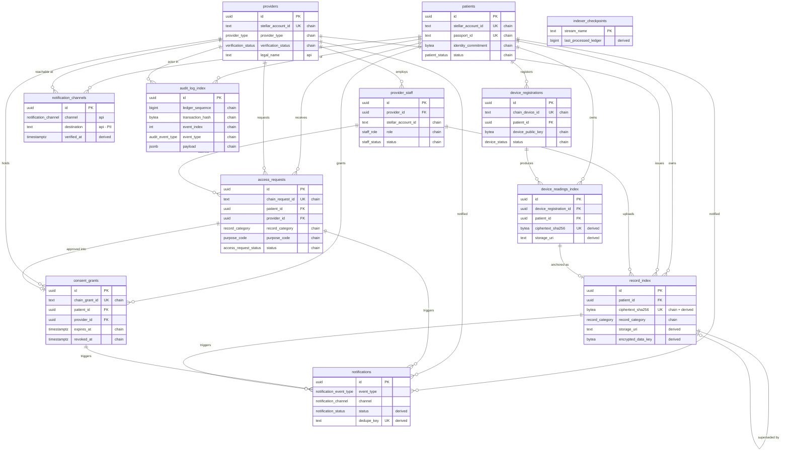

# PostgreSQL Schema Design — Core Entities

Design document for the application-side relational schema. This is the artifact issue
[#9](https://github.com/LockA-Medical-Passport/LockA-Backend/issues/9) asks to be reviewed
**before** migrations are written; the migrations themselves land in
[#10](https://github.com/LockA-Medical-Passport/LockA-Backend/issues/10) under
`Backend/storage/migrations/`, and the typed repositories over it in
[#11](https://github.com/LockA-Medical-Passport/LockA-Backend/issues/11).

Nothing here is executable yet. Column types are written in PostgreSQL terms so the
migrations are a transcription rather than a second design pass.

> Throughout this document, `#NN` means a **GitHub issue number**, not the "Issue N"
> numbering used inside [issues.md](../issues.md) — the two differ by one (this design is
> GitHub #9 / issues.md "Issue 8").

## Contents

- [What this schema is for](#what-this-schema-is-for)
- [Provenance: the three kinds of column](#provenance-the-three-kinds-of-column)
- [Entity relationship diagram](#entity-relationship-diagram)
- [Conventions](#conventions)
- [Tables](#tables)
- [Tables added beyond the issue's list](#tables-added-beyond-the-issues-list)
- [PII minimization review](#pii-minimization-review)
- [Open questions for review](#open-questions-for-review)

## What this schema is for

The chain is the source of truth for identity, provider verification, consent, record
commitments, device attestation, and audit events. Postgres exists because reading that
state from Soroban on every API call would be slow, and because some operational data
(where a ciphertext blob lives, whether an SMS was delivered) has no business being on a
public ledger at all.

So this schema is two things at once:

1. **A read model** of on-chain state, maintained by the indexer worker
   ([#21](https://github.com/LockA-Medical-Passport/LockA-Backend/issues/21)) from decoded
   contract events. API handlers read it and never write it.
2. **Off-chain operational data** the chain deliberately does not hold — object-storage
   locations, wrapped data keys, notification delivery state, contact details.

Keeping those two roles distinct is the single most important property of this design. A
bug that lets an API handler write a chain-mirrored column silently forks the read model
away from the ledger, and nothing downstream would notice.

> **Privacy rule** (from the [repository README](../../README.md)): no raw medical record,
> diagnosis, prescription, lab result, identity document, or personally identifiable medical
> information is stored on-chain — and, for this schema, none is stored in Postgres either.
> Postgres holds ciphertext *references* and hashes. The plaintext exists only in the
> patient's and authorized provider's clients, after decryption.

## Provenance: the three kinds of column

Every column in this schema is exactly one of the following. The tables below tag each
column with its class, which is what issue task 3 ("document which fields are populated
from on-chain events vs. submitted directly by API requests") asks for.

| Class | Written by | Meaning |
| --- | --- | --- |
| **`chain`** | The indexer worker only | Mirrored from a decoded Soroban contract event. The ledger is authoritative; if these disagree with the chain, the database is wrong. |
| **`api`** | An authenticated API request | Off-chain data a user or client supplied. Never appears on-chain. |
| **`derived`** | Backend services | Computed or assigned by the backend — storage locations, wrapped keys, delivery state, local timestamps. |

Two rules follow, and both are worth enforcing rather than documenting:

- **No API handler writes a `chain` column.** The repository layer (#11) should expose no
  method that can. Recommended belt-and-braces: give the API and worker separate database
  roles, and `GRANT` column-level `UPDATE` on `chain` columns only to the worker's role.
- **The indexer must be idempotent.** It will re-process events after a restart. Every
  chain-sourced table therefore carries a natural key from the ledger that a
  `ON CONFLICT DO UPDATE` can key on — see `audit_log_index.(transaction_hash, event_index)`
  and the `chain_*_id` unique constraints.

## Entity relationship diagram

Each entity box lists a representative subset of its columns — enough to see the keys and
the provenance pattern. The full column lists, types, and constraints are in
[Tables](#tables) below.

## Conventions

**Primary keys.** Every table uses an internal `uuid` surrogate key, generated by the
application as **UUIDv7** (time-ordered, so index locality does not degrade the way random
v4 keys do on insert-heavy tables like `audit_log_index`). Generated in Rust via the `uuid`
crate rather than in SQL — `uuidv7()` is a PostgreSQL 18 builtin and the compose stack
pins `postgres:16`.

On-chain identifiers are *not* used as primary keys. They are stored as unique columns
instead, so a contract migration that changes an identifier format does not cascade through
every foreign key in the database.

**Stellar accounts.** `text` with a `CHECK (char_length(...) = 56 AND ... LIKE 'G%')`
constraint. Ed25519 public keys in strkey form are always 56 characters starting with `G`.
Muxed (`M…`) addresses are deliberately rejected — SEP-10 authenticates a base account, and
allowing both forms would make "one account per patient" unenforceable.

**Timestamps.** `timestamptz` throughout, never naive `timestamp`. For chain-sourced rows,
`occurred_at` is the ledger close time and is for display and filtering only — the
authoritative ordering is `(ledger_sequence, event_index)`, because two events in the same
ledger share a close time.

**Enumerations.** Native PostgreSQL `ENUM` types rather than `text` + `CHECK`, so `sqlx`
can derive Rust types directly (#11) and an invalid value cannot be inserted. Adding a
variant later is `ALTER TYPE … ADD VALUE`, which is transactional from PostgreSQL 12
onward. Where a vocabulary is defined by a Soroban contract, the enum must be extended in
lockstep with the contract — noted per table below.

**Extensions.** `citext` (for case-insensitive email comparison) is the only extension this
design requires; the first migration must `CREATE EXTENSION IF NOT EXISTS citext`. If the
deployment target restricts extensions, substitute `text` with a
`CHECK (value = lower(value))` and normalize on write.

**Soft state, not soft deletes.** Nothing here is soft-deleted with an `is_deleted` flag.
Lifecycle is expressed with meaningful nullable timestamps (`revoked_at`, `expires_at`), so
"is this consent active?" has one unambiguous definition in SQL rather than two fields that
can disagree.

## Tables

### `patients`

Read model of `PatientIdentityRegistry`. One row per registered passport.

| Column | Type | Constraints | Provenance |
| --- | --- | --- | --- |
| `id` | `uuid` | PK | derived |
| `stellar_account_id` | `text` | **UNIQUE**, NOT NULL, strkey CHECK | chain |
| `passport_id` | `text` | **UNIQUE**, NOT NULL | chain |
| `identity_commitment` | `bytea` | NOT NULL | chain |
| `recovery_config_hash` | `bytea` | NULL | chain |
| `status` | `patient_status` | NOT NULL | chain |
| `registered_ledger` | `bigint` | NOT NULL | chain |
| `registered_at` | `timestamptz` | NOT NULL | chain |
| `updated_ledger` | `bigint` | NOT NULL | chain |
| `first_indexed_at` | `timestamptz` | NOT NULL, default `now()` | derived |

`patient_status`: `active`, `suspended`, `recovering`.

- **UNIQUE `stellar_account_id`** is the "unique Stellar account per patient" constraint the
  issue calls for. **UNIQUE `passport_id`** is its on-chain counterpart; both are enforced
  because the mapping between them is exactly what this table exists to cache.
- Indexes: the two unique constraints cover every lookup path the API has (auth resolves a
  session to a Stellar account; deep links resolve a passport id).

**Deliberately absent:** name, date of birth, national ID, address, phone, email, blood
type, allergies, emergency contacts. See [PII minimization](#pii-minimization-review) — none
of it is needed to index on-chain state, and "emergency info" from #22 belongs in
`record_index` as an encrypted record, not in plaintext columns.

### `providers`

Read model of `ProviderRegistry`. Organizations, not people.

| Column | Type | Constraints | Provenance |
| --- | --- | --- | --- |
| `id` | `uuid` | PK | derived |
| `stellar_account_id` | `text` | **UNIQUE**, NOT NULL, strkey CHECK | chain |
| `chain_provider_id` | `text` | **UNIQUE**, NOT NULL | chain |
| `provider_type` | `provider_type` | NOT NULL | chain |
| `verification_status` | `verification_status` | NOT NULL | chain |
| `verified_ledger` | `bigint` | NULL | chain |
| `legal_name` | `text` | NOT NULL | api |
| `display_name` | `text` | NULL | api |
| `country_code` | `char(2)` | ISO-3166-1 CHECK | api |
| `contact_email` | `citext` | NULL | api |
| `registered_at` | `timestamptz` | NOT NULL | chain |

`provider_type`: `hospital`, `clinic`, `laboratory`, `pharmacy`, `insurer`.
`verification_status`: `pending`, `verified`, `suspended`, `revoked`.

- Contract-defined vocabularies — extend in lockstep with `ProviderRegistry`.
- `legal_name` and `contact_email` are organizational, publicly-listed business details, not
  patient PII. They are `api` because the chain has no reason to carry a hospital's mailing
  address.
- Index: `(verification_status)` — `GET /providers/{id}` and any "list verified providers"
  view filter on it.

### `provider_staff`

Individual accounts a provider has authorized to act on its behalf.

| Column | Type | Constraints | Provenance |
| --- | --- | --- | --- |
| `id` | `uuid` | PK | derived |
| `provider_id` | `uuid` | FK → `providers(id)` ON DELETE CASCADE, NOT NULL | derived |
| `stellar_account_id` | `text` | NOT NULL, strkey CHECK | chain |
| `role` | `staff_role` | NOT NULL | chain |
| `status` | `staff_status` | NOT NULL | chain |
| `authorized_ledger` | `bigint` | NOT NULL | chain |
| `removed_at` | `timestamptz` | NULL | chain |

`staff_role`: `admin`, `clinician`, `technician`. `staff_status`: `active`, `removed`.

- **UNIQUE `(provider_id, stellar_account_id)`**, deliberately *not* a global unique on
  `stellar_account_id`. A clinician doing locum work at two clinics is ordinary in the
  target markets, and a global constraint would make the second authorization impossible to
  represent. The cost is that resolving "which provider is this account acting for?" needs
  the provider in context — which the API always has, since requests name the provider.
- Index: `(stellar_account_id)` for the reverse lookup during authorization.

**Deliberately absent:** staff names, licence numbers, contact details. A staff member is
identified by their Stellar account; nothing else is needed to authorize them.

### `access_requests`

Read model of the request half of `ConsentAccessControl`.

| Column | Type | Constraints | Provenance |
| --- | --- | --- | --- |
| `id` | `uuid` | PK | derived |
| `chain_request_id` | `text` | **UNIQUE**, NOT NULL | chain |
| `patient_id` | `uuid` | FK → `patients(id)`, NOT NULL | derived |
| `provider_id` | `uuid` | FK → `providers(id)`, NOT NULL | derived |
| `requested_by_staff_id` | `uuid` | FK → `provider_staff(id)`, NULL | derived |
| `record_category` | `record_category` | NOT NULL | chain |
| `purpose_code` | `purpose_code` | NOT NULL | chain |
| `requested_duration_secs` | `integer` | NOT NULL, CHECK > 0 | chain |
| `status` | `access_request_status` | NOT NULL | chain |
| `requested_ledger` | `bigint` | NOT NULL | chain |
| `requested_at` | `timestamptz` | NOT NULL | chain |
| `resolved_ledger` | `bigint` | NULL | chain |
| `resolved_at` | `timestamptz` | NULL | chain |

`access_request_status`: `pending`, `approved`, `rejected`, `expired`, `withdrawn`.
`record_category`: `consultation`, `laboratory`, `imaging`, `prescription`, `immunization`,
`device_reading`, `emergency_profile`, `insurance`.
`purpose_code`: `treatment`, `emergency`, `referral`, `laboratory_processing`,
`prescription_fulfilment`, `insurance_claim`, `public_health_reporting`.

- The FK columns are `derived` even though the underlying request is chain-sourced: the
  event carries Stellar account ids, and the indexer resolves those to internal UUIDs.
- Index: `(patient_id, status, requested_at DESC)` — serves
  `GET /patients/me/access-requests`, which is the hot path and is always
  patient-scoped, filtered by status, newest first.
- Index: `(provider_id, status)` for the provider's own view of outstanding requests.

**`purpose_code` is a closed enum, not free text.** This is a deliberate privacy decision
rather than a modelling convenience — see the [PII review](#pii-minimization-review).

### `consent_grants`

Read model of the grant half of `ConsentAccessControl`. This table is the authority for
"may this provider decrypt this category of this patient's records right now?"

| Column | Type | Constraints | Provenance |
| --- | --- | --- | --- |
| `id` | `uuid` | PK | derived |
| `chain_grant_id` | `text` | **UNIQUE**, NOT NULL | chain |
| `access_request_id` | `uuid` | FK → `access_requests(id)`, NULL | derived |
| `patient_id` | `uuid` | FK → `patients(id)`, NOT NULL | derived |
| `provider_id` | `uuid` | FK → `providers(id)`, NOT NULL | derived |
| `record_category` | `record_category` | NOT NULL | chain |
| `granted_ledger` | `bigint` | NOT NULL | chain |
| `granted_at` | `timestamptz` | NOT NULL | chain |
| `expires_at` | `timestamptz` | NOT NULL | chain |
| `revoked_at` | `timestamptz` | NULL | chain |
| `revoked_ledger` | `bigint` | NULL | chain |

- `access_request_id` is nullable because a patient can grant access proactively (QR-code
  handoff at a clinic desk) without a provider having requested it first.
- **No `status` column.** A grant is active iff `revoked_at IS NULL AND expires_at > now()`.
  Storing a status alongside the timestamps would create two sources of truth that drift the
  moment a grant expires without anything writing to the row.
- Index: `(patient_id, provider_id, record_category) WHERE revoked_at IS NULL` — a partial
  index that keeps the consent check on the record-retrieval path small, since revoked
  grants accumulate forever but are never consulted.
- CHECK `(expires_at > granted_at)` and CHECK `(revoked_at IS NULL OR revoked_at >= granted_at)`.

### `record_index`

Metadata and pointers for encrypted records. **This is the table the "no raw medical
content" acceptance criterion is about.**

| Column | Type | Constraints | Provenance |
| --- | --- | --- | --- |
| `id` | `uuid` | PK | derived |
| `patient_id` | `uuid` | FK → `patients(id)`, NOT NULL | derived |
| `ciphertext_sha256` | `bytea` | **UNIQUE**, NOT NULL, CHECK `octet_length = 32` | chain + derived |
| `record_category` | `record_category` | NOT NULL | chain |
| `issuer_provider_id` | `uuid` | FK → `providers(id)`, NULL | derived |
| `issued_by_staff_id` | `uuid` | FK → `provider_staff(id)`, NULL | derived |
| `storage_backend` | `storage_backend` | NOT NULL | derived |
| `storage_uri` | `text` | NOT NULL | derived |
| `ciphertext_size_bytes` | `bigint` | NOT NULL, CHECK > 0 | derived |
| `encrypted_data_key` | `bytea` | NOT NULL | derived |
| `key_encryption_key_id` | `text` | NOT NULL | derived |
| `anchored_ledger` | `bigint` | NULL | chain |
| `anchored_at` | `timestamptz` | NULL | chain |
| `superseded_by_id` | `uuid` | FK → `record_index(id)`, NULL | derived |
| `created_at` | `timestamptz` | NOT NULL, default `now()` | derived |

`storage_backend`: `s3`, `ipfs`.

- **`ciphertext_sha256` is one column doing two jobs, on purpose.** It is both the hash of
  the stored ciphertext and the value anchored on-chain by `RecordCommitmentRegistry`.
  Modelling it as two columns (`commitment_hash` and `ciphertext_hash`) would let them
  drift, and #18's acceptance criterion is precisely that they never do. One column makes
  the criterion structurally impossible to violate rather than something to test for.
  Its provenance is *both* — written as `derived` at upload time, then re-asserted by the
  indexer when the anchoring event is observed. `anchored_ledger IS NULL` is the signal that
  a record is stored but not yet confirmed on-chain.
- `encrypted_data_key` is the per-record data key from #25's envelope encryption, wrapped
  under a KEK. Storing the *wrapped* key here is safe and standard; `key_encryption_key_id`
  names which KEK wrapped it, so rotation is possible. **The KEK itself must never be in
  Postgres** — it lives in the KMS/secret store, and a database compromise alone must not
  yield plaintext.
- Index: `(patient_id, record_category, created_at DESC)` for `GET /patients/me/records`.
- Index: `(issuer_provider_id, created_at DESC)` for a provider's own upload history.
- Partial index `(patient_id) WHERE anchored_ledger IS NULL` so a reconciliation job can
  cheaply find records whose commitment never landed.

**Deliberately absent:** title, filename, description, clinical notes, diagnosis codes, the
plaintext MIME type, and any free-text field. A filename like `hiv-result-2026.pdf` is
medical information; there is no version of storing it that is safe. Clients keep their own
display names alongside the decrypted content.

### `device_registrations`

Read model of `DeviceAttestationRegistry`.

| Column | Type | Constraints | Provenance |
| --- | --- | --- | --- |
| `id` | `uuid` | PK | derived |
| `chain_device_id` | `text` | **UNIQUE**, NOT NULL | chain |
| `patient_id` | `uuid` | FK → `patients(id)`, NOT NULL | derived |
| `device_public_key` | `bytea` | NOT NULL, CHECK `octet_length = 32` | chain |
| `device_type` | `device_type` | NOT NULL | chain |
| `status` | `device_status` | NOT NULL | chain |
| `registered_ledger` | `bigint` | NOT NULL | chain |
| `registered_at` | `timestamptz` | NOT NULL | chain |
| `revoked_at` | `timestamptz` | NULL | chain |

`device_type`: `glucometer`, `blood_pressure_monitor`, `pulse_oximeter`, `wearable`,
`scale`, `thermometer`. `device_status`: `active`, `revoked`.

- `device_public_key` is the Ed25519 key #27 verifies reading signatures against. It is
  chain-sourced so a compromised backend cannot silently swap in its own key and forge
  readings.
- Index: `(patient_id, status)`.
- CHECK `(status = 'revoked') = (revoked_at IS NOT NULL)` keeps the two consistent.

**Deliberately absent:** serial number, manufacturer, model. See the PII review — a device
model is frequently a diagnosis in disguise.

### `device_readings_index`

Pointers to encrypted device readings. Same shape as `record_index`, separate table because
readings arrive at a far higher volume and have their own verification state.

| Column | Type | Constraints | Provenance |
| --- | --- | --- | --- |
| `id` | `uuid` | PK | derived |
| `device_registration_id` | `uuid` | FK → `device_registrations(id)`, NOT NULL | derived |
| `patient_id` | `uuid` | FK → `patients(id)`, NOT NULL | derived |
| `record_index_id` | `uuid` | FK → `record_index(id)`, NULL | derived |
| `recorded_at` | `timestamptz` | NOT NULL | api |
| `ingested_at` | `timestamptz` | NOT NULL, default `now()` | derived |
| `signature_verified` | `boolean` | NOT NULL | derived |
| `ciphertext_sha256` | `bytea` | **UNIQUE**, NOT NULL, CHECK `octet_length = 32` | derived |
| `storage_backend` | `storage_backend` | NOT NULL | derived |
| `storage_uri` | `text` | NOT NULL | derived |
| `encrypted_data_key` | `bytea` | NOT NULL | derived |
| `key_encryption_key_id` | `text` | NOT NULL | derived |

- `patient_id` is denormalized from `device_registrations` rather than joined on every read.
  It is safe to denormalize because device ownership does not change: re-assigning a device
  means revoking it and registering a new one.
- `recorded_at` is `api` — it is the *device's* claim about when the reading was taken, and
  is not independently verifiable. `ingested_at` is what the backend observed. Keeping both
  means a device with a wrong clock is diagnosable rather than silently corrupting history.
- `signature_verified` should be `true` for every stored row (#27 rejects bad signatures
  before storage). It exists so that a future relaxation — quarantining rather than
  rejecting — does not need a migration, and so the invariant is auditable in SQL.
- **UNIQUE `ciphertext_sha256`** doubles as replay protection: re-submitting a byte-identical
  signed reading conflicts instead of duplicating.
- Index: `(patient_id, recorded_at DESC)`.

**Deliberately absent:** the reading values themselves — no `heart_rate`, no
`glucose_mg_dl`. The measurement is inside the ciphertext.

### `notifications`

Outbound notification jobs and their delivery state. Off-chain only; the chain knows
nothing about email.

| Column | Type | Constraints | Provenance |
| --- | --- | --- | --- |
| `id` | `uuid` | PK | derived |
| `patient_id` | `uuid` | FK → `patients(id)`, NULL | derived |
| `provider_id` | `uuid` | FK → `providers(id)`, NULL | derived |
| `event_type` | `notification_event_type` | NOT NULL | derived |
| `channel` | `notification_channel` | NOT NULL | derived |
| `status` | `notification_status` | NOT NULL | derived |
| `dedupe_key` | `text` | **UNIQUE**, NOT NULL | derived |
| `access_request_id` | `uuid` | FK → `access_requests(id)`, NULL | derived |
| `consent_grant_id` | `uuid` | FK → `consent_grants(id)`, NULL | derived |
| `record_index_id` | `uuid` | FK → `record_index(id)`, NULL | derived |
| `attempts` | `smallint` | NOT NULL, default 0 | derived |
| `queued_at` | `timestamptz` | NOT NULL, default `now()` | derived |
| `sent_at` | `timestamptz` | NULL | derived |
| `failed_at` | `timestamptz` | NULL | derived |
| `last_error` | `text` | NULL | derived |

`notification_event_type`: `access_requested`, `access_approved`, `access_rejected`,
`access_revoked`, `access_expiring`, `record_added`, `device_reading_rejected`,
`provider_verified`. `notification_channel`: `email`, `sms`, `push`, `whatsapp`.
`notification_status`: `queued`, `sending`, `sent`, `failed`, `dead`.

- CHECK `(num_nonnulls(patient_id, provider_id) = 1)` — a notification has exactly one
  recipient subject.
- **UNIQUE `dedupe_key`** is what makes notification delivery idempotent under indexer
  replay. The key is derived from the triggering event's identity (e.g.
  `access_approved:{chain_grant_id}:{channel}`), so re-processing a ledger cannot re-send an
  SMS the patient already received.
- Index: `(status, queued_at) WHERE status IN ('queued', 'sending')` — the dispatcher's
  work queue, kept small by excluding the terminal states that make up the bulk of the table.

**Deliberately absent: the rendered message body.** Bodies are generated at send time from a
template plus the foreign keys above. Storing them would mean rows like *"Nairobi Hospital
requested access to your HIV test results"* sitting in the database and in every backup —
which is exactly the medical information this architecture exists to keep out of Postgres.
`last_error` stores the transport's error, and must never be allowed to contain the body.

### `audit_log_index`

Read model of `AuditEventEmitter`, and the sole source for the patient-facing access history
in #28. Append-only.

| Column | Type | Constraints | Provenance |
| --- | --- | --- | --- |
| `id` | `uuid` | PK | derived |
| `ledger_sequence` | `bigint` | NOT NULL | chain |
| `transaction_hash` | `bytea` | NOT NULL, CHECK `octet_length = 32` | chain |
| `event_index` | `integer` | NOT NULL | chain |
| `event_type` | `audit_event_type` | NOT NULL | chain |
| `actor_account_id` | `text` | NOT NULL, strkey CHECK | chain |
| `subject_account_id` | `text` | NULL, strkey CHECK | chain |
| `patient_id` | `uuid` | FK → `patients(id)`, NULL | derived |
| `provider_id` | `uuid` | FK → `providers(id)`, NULL | derived |
| `access_request_id` | `uuid` | FK → `access_requests(id)`, NULL | derived |
| `consent_grant_id` | `uuid` | FK → `consent_grants(id)`, NULL | derived |
| `record_index_id` | `uuid` | FK → `record_index(id)`, NULL | derived |
| `occurred_at` | `timestamptz` | NOT NULL | chain |
| `payload` | `jsonb` | NOT NULL | chain |

`audit_event_type`: `patient_registered`, `provider_registered`, `provider_verified`,
`staff_authorized`, `staff_removed`, `access_requested`, `access_approved`,
`access_rejected`, `access_revoked`, `record_anchored`, `record_superseded`,
`device_registered`, `device_revoked`.

- **UNIQUE `(transaction_hash, event_index)`** is the linchpin of #21's "no duplicate or
  missed events after restart" criterion. It is a natural key straight from the ledger, so
  the indexer can `INSERT … ON CONFLICT DO NOTHING` and replay any ledger range safely.
- Index: `(patient_id, occurred_at DESC, ledger_sequence DESC, event_index DESC)` — the
  patient-facing audit view, paginated newest-first. The tiebreakers matter: several events
  routinely share one ledger close time, and without them keyset pagination can skip rows.
- Index: `(event_type, occurred_at DESC)` for the filter in #28.
- `payload` holds the decoded event's remaining fields. It is safe as unstructured JSON
  *only because* the chain carries no PII by the platform's privacy rule — this table
  inherits that guarantee rather than establishing it. The indexer should still project
  known fields into typed columns rather than leaving readers to dig through JSON.
- No `UPDATE` or `DELETE` is ever issued against this table. Worth enforcing with a
  role-level `GRANT` of `SELECT, INSERT` only.

## Tables added beyond the issue's list

Two tables are not in the issue's list. Both are load-bearing for work already specified
elsewhere, so leaving them out would mean amending this design during #10 rather than
reviewing them now.

### `indexer_checkpoints`

Required by [#21](https://github.com/LockA-Medical-Passport/LockA-Backend/issues/21), which
specifies "persisting a cursor/checkpoint in Postgres" so the worker resumes after a
restart. There is nowhere else in the schema for that cursor to live.

| Column | Type | Constraints | Provenance |
| --- | --- | --- | --- |
| `stream_name` | `text` | PK | derived |
| `contract_id` | `text` | NOT NULL | derived |
| `last_processed_ledger` | `bigint` | NOT NULL | derived |
| `last_processed_event_index` | `integer` | NOT NULL | derived |
| `updated_at` | `timestamptz` | NOT NULL, default `now()` | derived |

Keyed by a logical `stream_name` rather than by `contract_id` alone, so a contract can be
re-deployed at a new address without the worker either re-indexing from genesis or silently
skipping the gap.

### `notification_channels`

Required by [#29](https://github.com/LockA-Medical-Passport/LockA-Backend/issues/29) — the
notification service needs somewhere to send. This is deliberately a separate table rather
than `email`/`phone` columns on `patients`, so that **every piece of direct-contact PII in
the system lives in exactly one table**. That makes column-level encryption, restricted
`GRANT`s, a shorter retention window, and "delete my contact details" a single-table
operation instead of a schema-wide audit.

| Column | Type | Constraints | Provenance |
| --- | --- | --- | --- |
| `id` | `uuid` | PK | derived |
| `patient_id` | `uuid` | FK → `patients(id)` ON DELETE CASCADE, NULL | derived |
| `provider_id` | `uuid` | FK → `providers(id)` ON DELETE CASCADE, NULL | derived |
| `channel` | `notification_channel` | NOT NULL | api |
| `destination` | `text` | NOT NULL — **PII** | api |
| `verified_at` | `timestamptz` | NULL | derived |
| `is_active` | `boolean` | NOT NULL, default `true` | derived |
| `created_at` | `timestamptz` | NOT NULL, default `now()` | derived |

- CHECK `(num_nonnulls(patient_id, provider_id) = 1)`.
- UNIQUE `(patient_id, channel, destination)` and UNIQUE `(provider_id, channel, destination)`.
- `verified_at IS NULL` means unverified; the dispatcher must refuse to send to it, so a
  typo'd phone number cannot leak an access-request alert to a stranger.

### Considered and deliberately excluded

- **`sessions`** — #13 offers "a signed JWT **or** an opaque session token backed by a
  `sessions` table". The config layer already carries `JWT_SIGNING_KEY`, so stateless JWTs
  are the standing choice and no table is needed. If #13 later wants server-side revocation,
  it should add the table with that decision, not inherit one speculatively.
- **`zk_verifications`** — #30 calls for persisting verification outcomes. Its shape depends
  on the proof system chosen there, and guessing it now would produce a table that gets
  migrated away before it is ever written to.

## PII minimization review

Task 4 of the issue. Each finding below is a column that a straightforward reading of the
requirements *would* have produced, and the reason it is not in the schema.

| Candidate field | Where it would have gone | Decision | Reasoning |
| --- | --- | --- | --- |
| Patient name, DOB, national ID | `patients` | **Excluded** | The backend never needs to know who a patient is. Auth resolves a Stellar account; every authorization decision is made against that account and on-chain consent. Identity for human presentation lives in the patient's client, and identity *proof* is the on-chain `identity_commitment`. |
| Emergency info (blood type, allergies) | `patients` | **Excluded** — store as a record | #22 lists it as a "non-sensitive profile field". It is not: blood type and allergy lists are medical data. Modelled as a `record_index` row with category `emergency_profile`, encrypted like any other record. Break-glass emergency access is then a consent problem, not a reason to hold plaintext. |
| Free-text access-request purpose | `access_requests.purpose_note` | **Excluded** — enum only | The most likely PII leak in the whole design. A provider typing *"suspected TB, needs prior chest imaging"* puts a diagnosis into a plaintext column, in a table patients can read. A closed `purpose_code` enum satisfies purpose-limited consent — which needs a *comparable* purpose, not prose — and cannot carry a diagnosis. |
| Record filename / title / MIME type | `record_index` | **Excluded** | Filenames are notoriously self-describing (`biopsy-result.pdf`). There is no safe subset, and the client already has the plaintext name after decryption. |
| Device manufacturer, model, serial | `device_registrations` | **Excluded** | A device model frequently implies a diagnosis: a continuous glucose monitor means diabetes; an implantable cardioverter means a cardiac condition. `device_type` is coarse enough to route and verify readings without being a de-facto diagnosis code. |
| Reading type / value | `device_readings_index` | **Excluded** | A row saying "blood glucose reading" is a diagnosis even with the value encrypted. Readings are filtered by device and time; clients group by type after decryption. |
| Rendered notification body | `notifications` | **Excluded** | Would reproduce clinical context in plaintext, in the database and in every backup, defeating the encryption everywhere else. Rendered at send time from template + IDs. |
| Staff names, licence numbers | `provider_staff` | **Excluded** | Authorization needs the account, not the person. |
| Patient email / phone | `patients` | **Relocated**, not excluded | Genuinely required by #29. Isolated in `notification_channels` so all direct-contact PII sits behind one table's access controls and retention policy. |
| Provider legal name, contact email | `providers` | **Kept** | Organizational, publicly listed, and needed for the patient to make an informed consent decision — a patient approving access must be able to see *which hospital* is asking. Not personal data of a patient. |
| Stellar account IDs | Several tables | **Kept, with a caveat** | Unavoidable — they are the join key to the ledger. But they are pseudonymous, not anonymous: the on-chain history of an account is public, so anyone who links an account to a person learns that person's *access pattern* (not content). Worth stating plainly in the privacy documentation rather than treating these as opaque IDs. |

**Net effect on the acceptance criterion:** no table holds raw medical record content. Every
clinical fact in the system reaches Postgres only as (a) a 32-byte ciphertext hash, (b) an
opaque storage URI, (c) a wrapped data key, or (d) a coarse category enum. The narrowest
remaining exposure is category-plus-timing metadata — a determined reader of a database dump
learns that a patient received a laboratory record on a date, but not what it says.

## Open questions for review

These need a decision before #10 writes migrations. None of them block the shape above.

1. **`record_category` and `purpose_code` are contract vocabularies.** The values listed
   here are proposed. They must match `ConsentAccessControl` exactly, or consent checks will
   compare enums that do not line up. Needs confirmation against `locka-contracts` before
   the enum types are created.
2. **Overlapping consent grants.** Should `(patient_id, provider_id, record_category)` be
   *uniquely* constrained among active grants? Cleaner to query, but only correct if the
   contract also forbids overlaps. Left unconstrained pending that answer, since a database
   constraint the chain does not share would make the indexer fail on legitimate state.
3. **`audit_log_index` growth.** Append-only, one row per contract event, forever. Monthly
   range partitioning on `occurred_at` is the obvious answer, but is only worth the
   complexity at a volume the MVP will not reach. Flagging it now so the partition key is
   chosen before the table is large enough to make partitioning painful.
4. **Retention for `notifications`.** Terminal rows (`sent`, `dead`) have no long-term value
   once the corresponding audit event exists on-chain. Suggest a 90-day purge, but that is a
   policy call rather than a schema one.
5. **Column-level encryption for `notification_channels.destination`.** Application-level
   (via the same KMS as record data keys) or `pgcrypto`? Application-level is more
   consistent with the rest of the design; deferred to #29.
